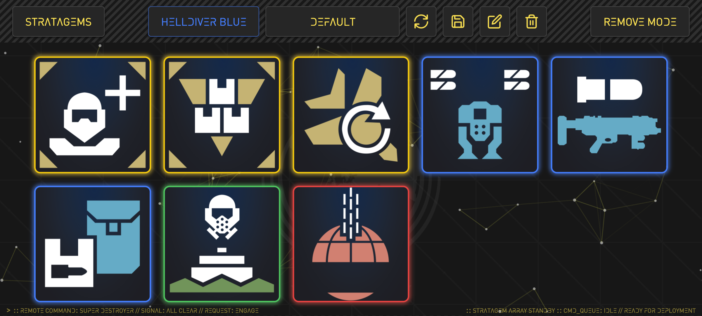
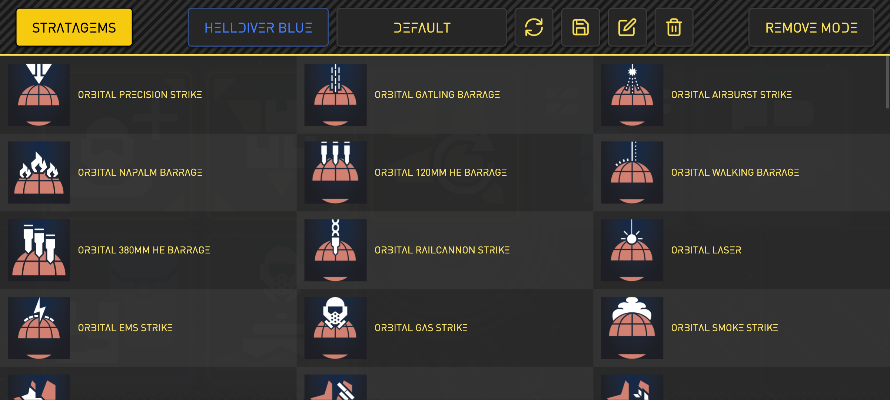
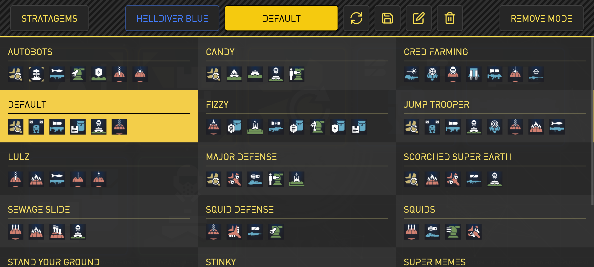
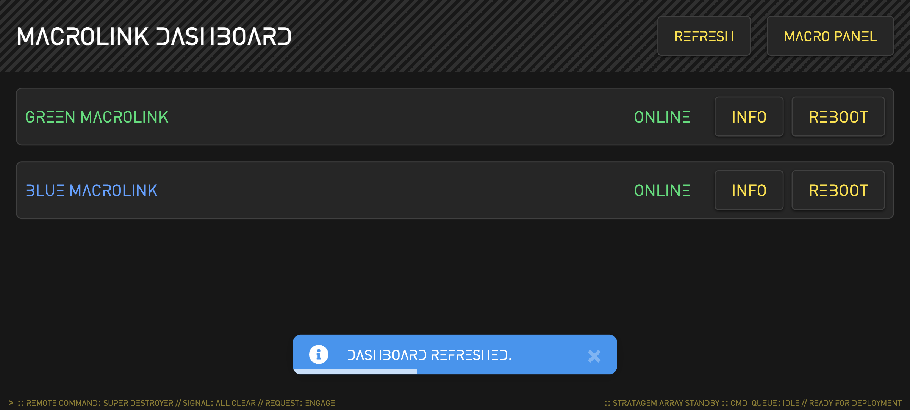

# MacroLink GUI

A web-based interface for managing and deploying Helldivers 2 stratagem macros to companion Raspberry Pi Pico HID devices.

## Screenshots

<div align="center">

### Main Interface


### Stratagem Selection


### Loadout Management


### Device Dashboard


</div>

## Features

- **Visual Macro Management**: Interface for organizing up to 10 macros per loadout
- **Multiple User Profiles**: Support for multiple devices with independent loadouts
- **Device Dashboard**: Monitor device status, uptime, and macro availability in real-time
- **Profile System**: Save, load, rename, and delete custom loadout configurations
- **Live Device Sync**: Automatic comparison with device macros to show availability

## Tech Stack

- **Vue 3** - Frontend framework
- **Vite** - Build tool and dev server
- **Tailwind CSS v4** - Styling
- **Pinia** - State management
- **Flask** - Backend API

## Getting Started

### Prerequisites

- Node.js 20.19+ or 22.12+
- Python 3.8+
- npm or yarn

### Installation

```bash
# Clone the repository
git clone https://github.com/LostMiracle/MacroLink_GUI.git
cd MacroLink_GUI

# Install frontend dependencies
npm install
```

### Running the Application

#### For Development

You have two options:

**Option 1: Frontend Development (with hot reload)**
```bash
# Terminal 1 - Start the Flask backend
python app.py

# Terminal 2 - Start the Vite dev server
npm run dev
```
Frontend available at `http://localhost:3000` with hot module replacement.

**Option 2: Production Mode**
```bash
# Build the frontend
npm run build

# Start the Flask backend (serves the built frontend)
python app.py
```
Application available at `http://localhost:8888` (or the port configured in app.py).

### Build for Production

```bash
npm run build
```

The built files will be in the `dist/` directory and are automatically served by the Flask backend.

## Pico Firmware

This GUI requires the MacroLink firmware to be installed on your Raspberry Pi Pico W device.

**Firmware repository:** Coming soon

The firmware handles:
- Network communication with the GUI
- Macro execution and input simulation
- Device status reporting

## Usage

1. Flash the MacroLink firmware to your Raspberry Pi Pico W
2. Connect your MacroLink device to the same network
3. Select your user (Green or Blue Helldiver)
4. Choose or create a loadout profile
5. Add stratagems from the library (available macros shown in yellow, unavailable in red)

## Project Structure

```
src/
├── assets/        # Styles and fonts
├── components/    # Vue components
├── composables/   # Reusable composition functions
├── data/          # Macro data and mappings
├── stores/        # Pinia state management
└── views/         # Page components
```

## License

MIT License - see [LICENSE](LICENSE) file for details

## Acknowledgments

- Inspired by Helldivers 2 stratagem system
- Built for the Raspberry Pi Pico community

